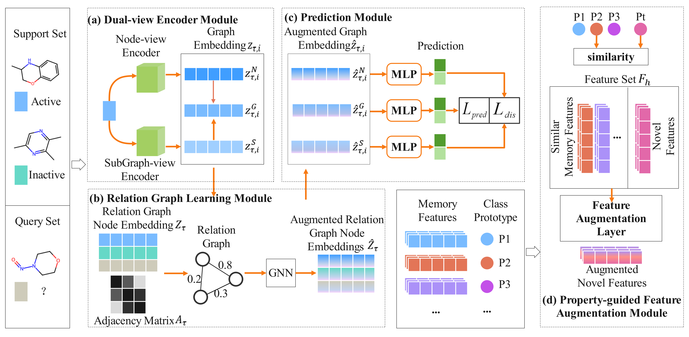
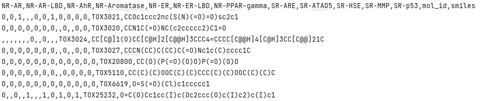
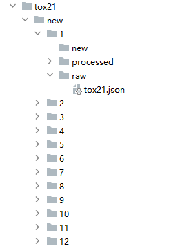

# PG-DERN

A repo for "Property-guided few-shot learning for molecular property prediction with dual-view encoder and relation graph learning network".

## Abstract

Molecular property prediction is an important task in drug discovery. However, experimental data for many drug molecules are limited, especially for novel molecular structures or rare diseases which affect the accuracy of many deep learning methods that rely on large training datasets. To this end, we propose PG-DERN, a novel few-shot learning model for molecular property prediction. A dual-view encoder is introduced to learn a meaningful molecular representation by integrating information from node and subgraph. Next, a relation graph learning module is proposed to construct a relation graph based on the similarity between molecules, which improves the efficiency of information propagation and the accuracy of property prediction. In addition, we use a MAML-based meta-learning strategy to learn well-initialized meta-parameters. In order to guide the tuning of meta-parameters, a property-guided feature augmentation module is designed to transfer information from similar properties to the novel property to improve the comprehensiveness of the feature representation of molecules with novel property. A series of comparative experiments on multiple benchmark datasets demonstrate that the proposed PG-DERN outperforms state-of-the-art methods.



## Requirements

#### Download projects

Download the GitHub repo of this project onto your local server: 

```
git clone https://github.com/Bombtsti/PG-DERN.git
```

#### Create environment

Create and activate virtual env using conda:

```
conda create -n "env_name" python=3.7
conda activate "env_name"
```

Install Pytorch and Torch_geometric:

```
pip install torch==1.7.0+cu110 torchvision==0.8.0+cu110 torchaudio==0.7.0 -f https://download.pytorch.org/whl/torch_stable.html

pip install torch_scatter==2.0.7 -f https://data.pyg.org/whl/torch-1.7.0+cu110.html
pip install torch_sparse==0.6.9 -f https://data.pyg.org/whl/torch-1.7.0+cu110.html
pip install torch_geometric==1.7.0
```

Other python packages installed from the requirements.txt:

```
pip install -r requirements.txt
```

#### Docker image

Deploying the environment via the docker command line：

```
# Build the Docker image
sudo docker build --build-arg env_name=pgdern -t pgdern-image:v1 .
# Create and start the docker container
sudo docker run --name pgdern-con --gpus all -it pgdern-image:v1 /bin/bash
# Check whether the environment deployment is successful
conda list 
```

## Project Structure

```
│
├─data						-Data directory
│
├─model						-Model files
│  │  utils.py
│  │
│  ├─datasets				-Files related to data
│  │      batch.py			
│  │      data.py			-A python script used to preprocess data
│  │      loader.py			-A python script used to preprocess data
│  │      samples.py		-A python script used to load and sample data from dataset
│  │      __init__.py
│  │
│  ├─models
│  │      classifer.py		-A python script used to classifer
│  │      gnns.py			-Various graph neural networks used by the model
│  │      maml.py			-MAML-based meta learning
│  │      model.py			-The main model code
│  │      trainer.py		-A python script used to train the model
│  │      __init__.py
│  │
│  └─model_file				-pretrained model files
│
└─prediction				-model file and predictions
│  Dockerfile.txt
│  main.py					-main function
│  parser.py				-Hyper-parameters
│  Readme.md				
│  requirements.txt
```

## Datasets

The benchmark datasets are downloaded from the repository [Data](https://drive.google.com/file/d/1K3c4iCFHEKUuDVSGBtBYr8EOegvIJulO/view) from [Wang et al. (2021)](https://arxiv.org/abs/2107.07994).

- **Note:** Please unzip it to the data folder after the download as follows:

```
│
├─data						
│  ├─tox21
│  │
│  ├─sider
│  │
│  ├─muv
│  │
│  └─toxcast
```

For a given new dataset, you need to first divide the dataset into the format needed for the model. You can use the splitdata.py script we provide to accomplish this step. For example, tox21.csv records 12 molecular properties and molecular smiles as follows: 



Use splitdata.py to process tox21.csv into a format the model can handle as follows:




Then, you can train the model on a new dummy dataset.

## Train

You can first tune the hyper-parameters in parser.py.

And then, run the main.py use the command:

```
python main.py
```

## baselines

To demonstrate the superiority of the proposed model, we conduct experiments to compare our approach with the following state-of-the-art (SOTA) models:

- **Pre-GNN** - [Link](https://github.com/snap-stanford/pretrain-gnns)
- **Meta-MGNN** - [Link](https://github.com/zhichunguo/Meta-MGNN)
- **PAR** - [Link](https://github.com/tata1661/PAR-NeurIPS21)
- **MAML-MTA** - None
- **HSL-RG** - None

The above are benchmark models from the last few years, and other models we have cited in the paper.

## Results

We compared with different baseline models and their experimental results are as follows：

| Method       | Tox21          |                | SIDER          |                | MUV            |                | ToxCast        |                |
| ------------ | -------------- | -------------- | -------------- | -------------- | -------------- | -------------- | -------------- | -------------- |
|              | 10-shot        | 1-shot         | 10-shot        | 1-shot         | 10-shot        | 1-shot         | 10-shot        | 1-shot         |
| Siamese      | 80.40±0.35     | 65.00±1.58     | 71.10±4.32     | 51.43±3.31     | 59.96±5.13     | 50.00±0.17     | -              | -              |
| ProtoNet     | 74.98±0.32     | 65.58±1.72     | 64.54±0.89     | 57.50±2.34     | 65.88±4.11     | 58.31±3.18     | 63.70±1.26     | 56.36±1.54     |
| TPN          | 76.05±0.24     | 60.16±1.18     | 67.84±0.95     | 62.90±1.38     | 65.22±5.82     | 50.00±0.51     | 62.74±1.45     | 50.01±0.05     |
| EGNN         | 81.21±0.16     | 79.44±0.22     | 72.87±0.73     | 70.79±0.95     | 65.20±2.08     | 62.18±1.76     | 63.65±1.57     | 61.02±1.94     |
| IterRefLSTM  | 81.10±0.17     | 80.97±0.10     | 69.63±0.31     | 71.73±0.14     | 49.56±5.12     | 48.54±3.12     | -              | -              |
| MAML         | 80.21±0.24     | 75.74±0.48     | 70.43±0.76     | 67.81±1.12     | 63.90±2.28     | 60.51±3.12     | 66.79±0.85     | 65.97±5.04     |
| MAML-MetaMix | 81.83±0.15     | 81.13±0.21     | 73.34±0.18     | 72.69±0.31     | 67.38±1.03     | 66.39±1.22     | 70.22±0.92     | 70.03±1.14     |
| Sharp-MAML   | 75.37±0.23     | 74.59±0.56     | 71.02±0.81     | 68.43±0.96     | 65.52±2.01     | 65.12±2.98     | 67.56±1.01     | 66.49±1.98     |
| MAML-MTA     | 83.33±0.34     | 83.09±0.42     | 77.43±0.23     | 74.63±0.37     | 69.70±1.05     | 67.42±1.12     | 73.31±0.89     | 71.58±1.26     |
| Pre-GNN      | 82.14±0.08     | 81.68±0.09     | 73.96±0.08     | 73.24±0.12     | 67.14±1.58     | 64.51±1.45     | 73.68±0.74     | 72.90±0.84     |
| Meta-MGNN    | 82.97±0.10     | 82.13±0.13     | 75.43±0.21     | 73.36±0.32     | 68.99±1.84     | 65.54±2.13     | -              | -              |
| Pre-PAR      | 84.93±0.11     | 83.01±0.09     | 78.08±0.16     | 74.46±0.29     | 69.96±1.37     | 66.94±1.12     | 75.12±0.84     | 73.63±1.00     |
| HSL-RG       | **85.56±0.28** | 84.09±0.20     | 78.99±0.33     | 77.53±0.41     | 71.26±1.08     | 68.76±1.05     | **76.00±0.81** | 74.40±0.82     |
| **PG-DERN**  | 85.25±0.29     | **84.12±0.08** | **79.62±0.32** | **77.69±0.38** | **71.62±0.33** | **69.65±1.02** | 75.24±0.37     | **74.56±0.18** |

## NoteBooks

To ensure transparency of the experimental results, all models trained on the dataset as well as the predictions of the models have been uploaded to [Zenodo](https://zenodo.org/records/10443787). Additionally, in order to present the results of the experiments in a more intuitive way, we provide a comprehensive Jupyter notebook in our repository, where we load all the prediction result files and visualize these results in the form of statistical charts. 

## References

```
@InProceedings{wang2021property,
  title={Property-Aware Relation Networks for Few-Shot Molecular Property Prediction},
  author={Wang, Yaqing and Abuduweili, Abulikemu and Yao, Quanming and Dou, Dejing},
  booktitle = {Advances in Neural Information Processing Systems},
  year={2021},
}
```
